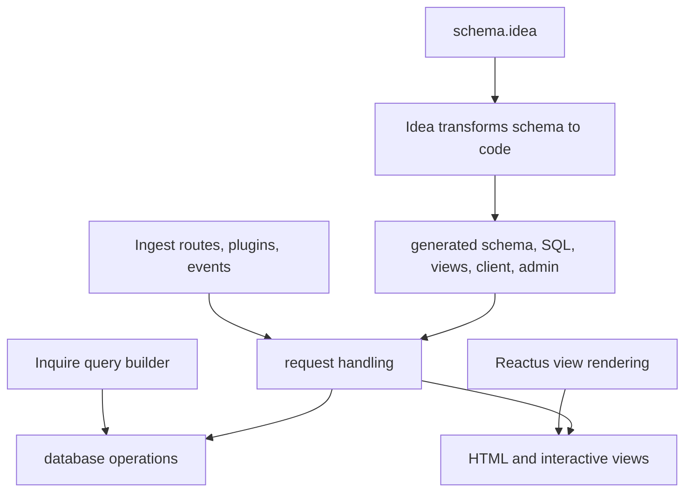

# 001 What Stackpress Is

Understand Stackpress as a full-stack framework built from four smaller open
source projects. This page matters because Stackpress can look like many
things at once: a server framework, a query layer, a template system, a code
generator, and a set of built-in app features.

**Previously:** `Orientation` explained how to read the numbered course path.
This page gives you the first technical map, so the hands-on lessons do not
feel like disconnected commands, folders, and generated files.

## 001.1. The Short Version

Stackpress is a full-stack application framework. It helps you build the server
side, database layer, views, generated code, authentication flows, admin
screens, and API surfaces inside one coordinated project.

The easiest way to picture it is a workshop with four main stations. One
station handles requests, one talks to SQL databases, one renders UI, and one
turns schema ideas into code you can inspect and use.

## 001.2. The Four Projects Under Stackpress

At its core, Stackpress combines four open source projects. You do not need to
learn them separately on day one, but knowing their jobs helps you understand
why Stackpress is shaped the way it is.

 - [Ingest](https://www.stackpress.io/ingest) is the server and serverless
   framework. It owns routes, plugins, events, request handling, response
   handling, and adapter-style deployment surfaces.
 - [Inquire](https://www.stackpress.io/inquire) is the SQL query builder. It
   gives Stackpress a way to build database operations without tying every
   lesson to handwritten SQL strings.
 - [Reactus](https://www.stackpress.io/reactus) is the reactive template
   engine. Stackpress uses it through the view layer so server data can become
   rendered pages.
 - [Idea](https://www.stackpress.io/idea) transforms schema declarations into
   code. It is the reason a `schema.idea` file can become generated schema,
   SQL, view, client, and admin output.

These projects are separate because each problem is different. Serving a route,
building a query, rendering a page, and generating code should not all be
hidden inside one oversized abstraction.

## 001.3. What Stackpress Adds On Top

Stackpress brings those projects together and adds full-stack application
features around them. The goal is not only to expose primitives; the goal is to
give app developers a practical path from source files to running behavior.

The built-in Stackpress layer includes:

 - authentication and session handling
 - roles and permissions
 - languages and translations
 - OAuth and RESTful API surfaces
 - administration dashboards

These features are important because most real apps need them early. Without a
framework layer, a junior developer often has to choose and wire several
libraries before they can even protect a page or list records in an admin
screen.

## 001.4. How The Pieces Work Together

Think of Stackpress as a kitchen line. Ingest receives the order, Inquire talks
to the pantry, Reactus plates the result, and Idea prepares repeatable
ingredients from the recipe you wrote in `schema.idea`.

The diagram shows why Stackpress is more than one package. A page request may
enter through Ingest, read generated code from Idea, use Inquire to load data,
and render through the view system that connects to Reactus.

## 001.5. The Source-To-App Loop

Most Stackpress work follows a repeatable loop. You edit source input, run or
inspect generated output when needed, then verify runtime behavior in the app.

The main source inputs are:

 - `schema.idea`
 - `config/*`
 - `plugins/*`
 - `public/*`

Those files have different jobs. `schema.idea` describes app structure,
`config/*` controls boot and feature setup, `plugins/*` owns app behavior, and
`public/*` holds assets the browser can request.

## 001.6. What To Remember First

Do not try to memorize every package boundary yet. The first useful mental
model is that Stackpress combines runtime, data, views, generation, and
built-in app features into one project workflow.

When later lessons mention source input, generated output, runtime behavior,
plugins, views, sessions, roles, translations, OAuth, or admin dashboards, you
should be able to place that topic on the map. Exact imports and API details
belong in reference pages after the course gives you a reason to look them up.

Start `002 Getting Started` when you are ready to build the first route. Use
the API reference later, after the course gives you a reason to look up exact
exports and runtime details.

**Learning checkpoint:** Before moving on, make sure you can explain the four
projects under Stackpress and what Stackpress adds on top. You do not need
every package detail yet; you need the map that helps you decide where to look
when a later lesson changes a file.

**Next course:** Continue with `Getting Started`. The next lesson turns this
map into a small running app so the framework pieces become visible in a
browser.
