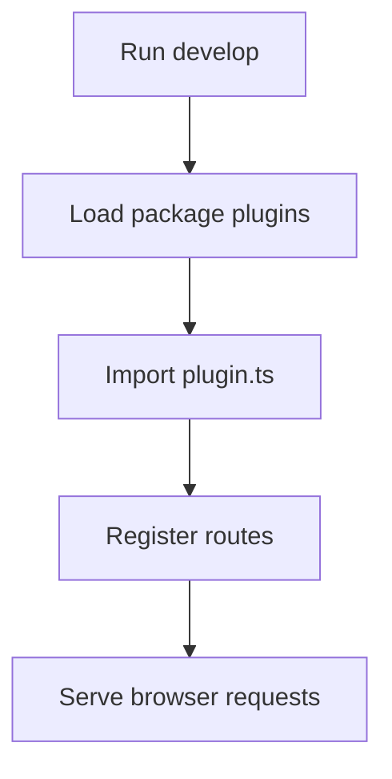

# 002 Getting Started

Create the smallest useful Stackpress app, add one route, and verify that the development server can return a response. This lesson is the first hands-on proof that Stackpress can load your code and answer a browser request.

**Previously:** `What Stackpress Is` introduced the four projects and built-in
features behind Stackpress. This lesson turns that map into the smallest app
shape that can load a local plugin and answer a request.

## 002.1. Goal

Every framework has a smallest useful shape: the few files needed before anything can run. In Stackpress, that first shape is an npm project, one plugin file, and one route that proves the server can answer.

The first success is small on purpose: a route that returns `Hello Stackpress`. Once that works, every later feature has a known-good starting point.

You do not need React, schema files, generated code, or a database yet. Those come later in the course after the runtime loop is working.

## 002.2. Create the App

Before you start, make sure you have Node.js installed and can run commands from a terminal. Use an empty folder so every file created in this lesson has an obvious purpose.

Start in an empty folder for your app:

```bash
npm init -y
npm i stackpress
```

Those two commands give the folder a `package.json` and install Stackpress.
Nothing app-specific exists yet; you have only prepared the room where the
first route will live.

Next, create `plugin.ts`:

```ts
import type { HttpServer } from 'stackpress/http';

export default function plugin(server: HttpServer) {
  server.get('/', ({ res }) => {
    res.set('text/plain', 'Hello Stackpress');
  });
}
```

This file is the first piece of app behavior. The default export receives the
Stackpress server, `server.get('/')` listens for the home route, and
`res.set('text/plain', 'Hello Stackpress')` sends a plain text answer back to
the browser.

Now update `package.json` last. Add the module type and the plugin list. This is the step that tells Stackpress which local file should be loaded when the app starts:

```json
{
  "type": "module",
  "plugins": [
    "./plugin"
  ]
}
```

Keep the other fields that `npm init -y` created. The important part is that `type` and `plugins` are present.

The plugin list is the bridge between the package file and your app code. By
adding `"./plugin"`, you tell Stackpress to load the file you just created
when the app starts.

## 002.3. Open the Project

You created the smallest Stackpress app contract:

 - `package.json` defines the app as an ES module project.
 - `stackpress` provides the local development server.
 - `plugin.ts` contains app-specific behavior.
 - `plugins` tells Stackpress which local plugin file to load.
 - `server.get('/', handler)` registers a route for the home path.

This is the manual hello-world scaffold from the first guide, not the larger
`stackpress create` project scaffold. The larger scaffold copies config,
plugins, schema, scripts, and supporting files; this lesson stays smaller so
you can see the runtime contract before extra project structure appears.

The package file and plugin file now point at each other. `package.json` tells
Stackpress what to load, and `plugin.ts` contains the route that will answer
the first browser request.

## 002.4. Run the First Command

This section runs the app so the scaffold becomes more than a folder of files.
The first command starts the Stackpress development server, loads your plugin,
and gives the browser a route to call.

Once the files are in place, run the development server:

```bash
npx stackpress develop -v
```

The `develop` command starts the local development server. The `-v` flag turns
on verbose logging, which is helpful while learning because loading problems
are easier to see.

Open:

```text
http://localhost:3000/
```

You should see:

```text
Hello Stackpress
```

If you prefer the terminal, you can verify the route with:

```bash
curl http://localhost:3000/
```

The visible result proves three things at once. The package installed,
Stackpress found your plugin, and the route returned the text you wrote.

## 002.5. Understand What You Created

The first route works because a few small pieces now cooperate. This section
names those pieces before you start changing the app, so later errors are
easier to place.

### 002.5.1. Scaffold

A scaffold is the smallest project shape that lets the framework boot. For
this page, the scaffold has only three pieces, and each one has a job. The
list below names the pieces you just created:

 - `package.json`
 - `node_modules`
 - `plugin.ts`

That is enough to prove the runtime works. It is not the full project shape
you will use for a larger app.

### 002.5.2. Local Plugin

A local plugin is a file owned by your app. It receives the Stackpress server
and registers behavior on it. In this scaffold, `plugin.ts` owns one route;
later pages use local plugins for page handlers, views, events, stores, and
app integrations.

### 002.5.3. Route

A route connects an HTTP path to a handler function. In this example, the path
is `/` and the handler writes the response, so the browser has something
visible to show. The handler looks like this:

```ts
server.get('/', ({ res }) => {
  res.set('text/plain', 'Hello Stackpress');
});
```

The route listens for `GET /`. The handler receives a request object and a response object. This first handler ignores the request and writes a plain text response.

### 002.5.4. Plugin List

The `plugins` array in `package.json` is how Stackpress finds your app behavior:

```json
{
  "plugins": [
    "./plugin"
  ]
}
```

Create the plugin file before you register it. That order makes startup errors easier to understand because Stackpress will only try to load files that already exist.

## 002.6. Read The Logs

Verbose logs are useful because they tell the startup story in order. When the
server starts, Stackpress needs to find the plugin list, load the plugin,
register the route, and then serve browser requests.



The diagram gives you a debugging order. If the app fails before a request
arrives, inspect package and plugin loading first; if the route is missing,
inspect `plugin.ts` and the route registration next.

Later projects may start from a bootstrap module instead of only the
`plugins` list in `package.json`. That adds more startup steps, but the habit
is the same: read logs from loading, to registration, to request handling.

## 002.7. Check the Files

This section checks whether you understand the scaffold well enough to change it. Small edits are useful here because they show which file controls the response and which file controls plugin loading.

### 002.7.1. Change The Response

Edit the text in `plugin.ts`:

```ts
res.set('text/plain', 'Hello from my app');
```

Restart the development server if it does not pick up the change automatically, then refresh the browser. If the browser shows the new text, you know the route is coming from your local plugin.

### 002.7.2. Add Another Route

Add a second route inside the same plugin function:

```ts
server.get('/about', ({ res }) => {
  res.set('text/plain', 'About this app');
});
```

Then open:

```text
http://localhost:3000/about
```

This second route proves the plugin can register more than one handler. The important change is the path, because `/about` now points to a different response than `/`.

### 002.7.3. Fix A Plugin Loading Error

If Stackpress cannot load your plugin, check these first:

 - `package.json` includes `"type": "module"`.
 - The `plugins` entry points to `"./plugin"`.
 - The file is named `plugin.ts`.
 - The file has a default export.
 - The development command is running from the app folder.

## 002.8. What You Now Have

The main idea to carry forward is that a scaffold is not the finished app. It
is the smallest contract that proves Stackpress can load your code and answer a
request.

You now have a running Stackpress app with one handwritten route. More importantly, you have seen the loop you will repeat often: edit a file, run the server, inspect the result, and adjust the source.

Next, the plugin lessons show how to organize more app behavior without
turning the first scaffold file into a dumping ground. The development command
stays part of that workflow because every later route, event, and view still
needs a way to become visible.

For lookup details, use the reference pages:

 - [CLI command details](/reference/cli-reference)
 - [HTTP route exports](/reference/http)
 - [Plugin export details](/reference/plugin)

**Learning checkpoint:** Before moving on, make sure you can explain what
`package.json`, `plugin.ts`, and `server.get('/')` each contributed to the
first response. You should also be able to change the response text and know
which file made the browser output change.

**Next course:** Continue with `Plugins`. The next lesson explains the runtime
boundary that Stackpress uses to load app behavior.
