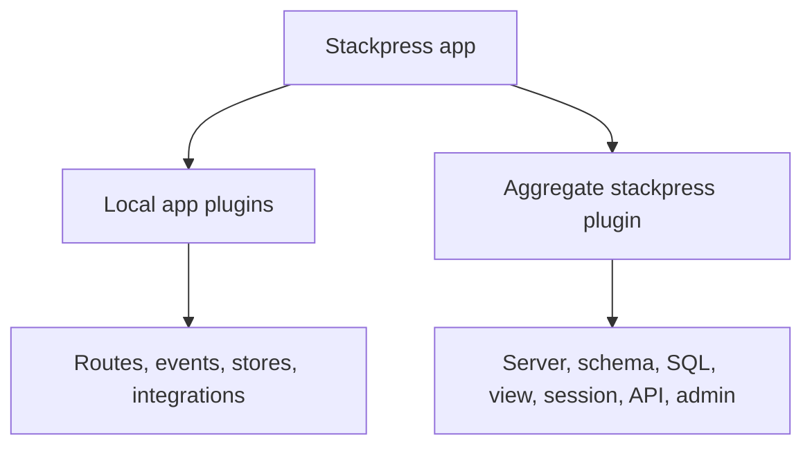

# 111 Composition

Composition is how Stackpress lets local app behavior sit beside framework
behavior without turning one file into the whole application. The app can load
your plugins and the aggregate `stackpress` plugin, and each plugin registers
the behavior it owns.

**Previously:** `Plugins` introduced plugins as loadable units of behavior.
Here, the focus shifts to how several plugins work together in one app.

## 111.1. What Composition Means

A growing app quickly stops being one kind of code. Routes, events, stores,
generated output, view rendering, sessions, and integrations all need a place
to live.

Composition means each plugin contributes its part of the app. Instead of one
bootstrap file knowing every detail, Stackpress can load focused units and let
each unit register its own routes, events, services, or framework behavior.

## 111.2. Packages And Plugins

A typical Stackpress app can list local plugins first, then the aggregate
framework plugin:

```json
{
  "plugins": [
    "./plugins/app/plugin",
    "./plugins/store/plugin",
    "stackpress"
  ]
}
```

Read that list as ownership. `./plugins/app/plugin` owns app-facing pages and
events, `./plugins/store/plugin` owns local store wiring, and `stackpress`
loads the standard framework layer.

## 111.3. What The Aggregate Plugin Loads

The aggregate `stackpress` plugin is not a vague label. In
`packages/stackpress/src/plugin.ts`, it calls the framework package plugins in
one coordinated place.

```ts
server(ctx);
schema(ctx);
language(ctx);
csrf(ctx);
sql(ctx);
view(ctx);
session(ctx);
api(ctx);
admin(ctx);
```

This example explains why the package list can stay short. The app can load
`stackpress`, and that aggregate entry wires the framework modules that make
server routes, schema generation, language, CSRF, SQL, views, sessions, API,
and admin behavior available.

## 111.4. Local Plugins Still Own App Behavior

The aggregate plugin gives the app the framework layer. Your local plugins
still own the product-specific work: app pages, custom events, stores,
integrations, and feature-specific helpers.



The diagram separates the two responsibilities. Local plugins explain what
your app does, while the aggregate plugin provides the Stackpress capabilities
your app can use.

## 111.5. Decide Where Behavior Belongs

Use local plugins when the behavior is specific to your app. Use the aggregate
framework plugin when you want the normal Stackpress package capabilities.

 - route, page, event, store, or integration behavior belongs in a local plugin
 - framework-wide capabilities come from the `stackpress` aggregate plugin
 - schema meaning and generated metadata belong later in `schema.idea`

This split keeps the first runtime path clear. You can add behavior without
needing to list every framework package plugin by hand.

**Learning checkpoint:** Before moving on, make sure you can explain the
difference between local plugins and the aggregate `stackpress` plugin. Local
plugins define app behavior; the aggregate plugin loads the framework layer.

**Next course:** Continue with `Local Plugins`. That course writes a small
plugin your app owns.
