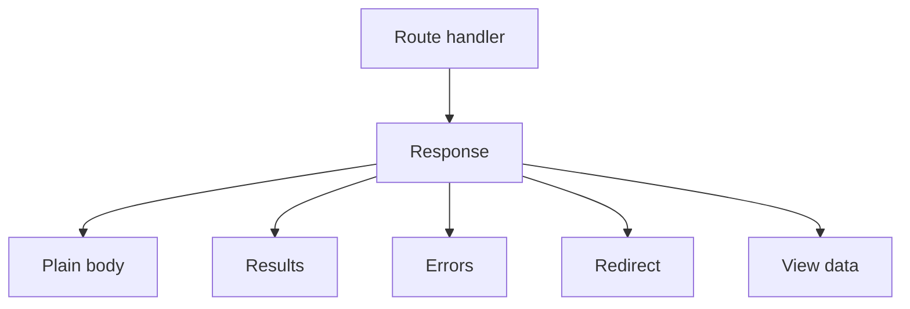

# 122 Response

Shape route output with response results, errors, redirects, status, cookies,
session data, and rendering behavior. If the request is the route's input
envelope, the response is the answer the route sends back.

**Previously:** `Request` explained the incoming values a route can read.
Here, the focus shifts to the outgoing answer the route prepares.

## 122.1. Use Case

A route is only useful when it can answer clearly. Sometimes that answer is
JSON for another program, sometimes it is HTML for a browser, and sometimes it
is a redirect, error, or result payload for the next part of the app. This
lesson teaches how to choose the response surface that matches the answer.

## 122.2. Return HTML Or JSON

Use `res.json()` for API-style structured output:

```ts
server.get('/status', ({ res }) => {
  res.json({
    ok: true,
    service: 'stackpress'
  });
});
```

This route answers with structured JSON. That matters when another program,
browser tool, or frontend script needs to parse the response instead of reading
plain text.

Open:

```text
http://localhost:3000/status
```

The response should contain JSON for the route. That check confirms the route
is sending structured data instead of plain text or HTML, and another program
can parse the response without guessing what the text means.

Use `res.html()` when the route returns an HTML string directly:

```ts
server.get('/hello', ({ res }) => {
  res.html('<h1>Hello Stackpress</h1>');
});
```

This response is meant for the browser to render directly. Use `res.html()`
when the route is sending markup instead of data for another program to parse.

Use `res.set()` when the route needs a specific MIME type such as plain text,
an image stream, or server-sent events:

```ts
server.get('/health.txt', ({ res }) => {
  res.set('text/plain', 'OK');
});
```

This helper is the most explicit form: you choose the MIME type and the body.
It is useful for plain text checks, file streams, and responses that do not fit
the JSON or HTML helpers.

## 122.3. Choose One Outcome

The response object carries the outcome of the route. A route can write a body
directly, store result data, mark an error, redirect, set status, or prepare
view data for rendering.



The diagram shows that a response can carry more than one kind of outcome. A
route should still choose one clear final answer, but the response object gives
you separate surfaces for body data, result data, redirects, errors, headers,
session writes, and view metadata.

## 122.4. Set Status And Headers

Response surfaces are easy to confuse when you first learn route handlers.
Results, rows, errors, redirects, headers, session data, and status codes all
shape the answer, but each one communicates a different kind of outcome.

### 122.4.1. Results

Use `res.results()` for the main successful outcome of a request. A detail page
might return one record. A route that prepares a React page can also use
results as the main payload for the view.

```ts
server.get('/articles/:slug', ({ req, res }) => {
  res.results({
    slug: req.data('slug')
  });
});
```

This example stores the route's main successful result. A view or adapter can
then treat that result as the payload of the response.

Use `res.rows()` when the successful outcome is a collection with a total
count. That shape is useful for list pages because the response carries both
the rows and the count needed for paging.

```ts
server.get('/articles', ({ res }) => {
  res.rows([
    { id: 1, title: 'First article' },
    { id: 2, title: 'Second article' }
  ], 2);
});
```

Rows are for list-shaped answers. The second argument gives the total count, so
pagination code can know whether the list has more records than the current
page shows.

Pass a status code when creating a resource or returning a non-default status:

```ts
res.results({ id: 123 }, 201, 'Created');
```

The payload still goes through `res.results()`, but the status code now says
the route created something. The status tells clients how to interpret the
answer.

### 122.4.2. Errors

Use `res.setError()` when a request could not be completed. Keep the main error
message useful for the user, and use the `errors` object for field-level detail.

```ts
server.post('/articles', ({ req, res }) => {
  const title = req.data('title');

  if (!title) {
    res.setError('Validation failed.', {
      title: 'Enter a title.'
    }, [], 400);
    return;
  }

  res.json({ title });
});
```

The error response stops the route before it pretends the input was valid. The
field-level error gives the UI a specific message to show near the missing
value.

### 122.4.3. Redirects

Use `res.redirect()` after actions such as sign-in, create, update, or delete
when the browser should move to another page. Redirects are common after
state-changing routes because the user should usually land on a stable page
after the action finishes.

```ts
server.post('/articles', ({ res }) => {
  res.redirect('/articles');
});
```

Redirects are common after write actions. Instead of leaving the browser on the
form submission route, the response points it to the page it should load next.

### 122.4.4. View Data

Use `res.data` for response-side metadata and view props. Do not mix view
configuration into the main result payload.

```ts
server.get('/articles', ({ res }) => {
  res.data.set('page', {
    title: 'Articles'
  });
  res.results({ section: 'articles' });
});
```

This example separates page metadata from the main result. `res.data` carries
view-facing notes, while `res.results()` stays focused on the route's payload.

### 122.4.5. Headers

Use `res.headers` for cache, CORS, content negotiation, and other HTTP
metadata. Headers do not replace the body; they add instructions around how
clients should treat the body.

```ts
server.get('/api/articles', ({ res }) => {
  res.headers.set('Cache-Control', 'public, max-age=300');
  res.json({ articles: [] });
});
```

The header does not change the JSON body. It changes how clients and caches are
allowed to treat that body after the route sends it.

### 122.4.6. Session Data

Use `res.session` when the route needs to write session state for the next
request. Request session reads come from `req.session`; response session writes
belong on `res.session`.

```ts
server.post('/auth/signin', ({ res }) => {
  res.session.set('profileId', 'profile_123');
  res.redirect('/account');
});
```

The session write prepares state for the next request. The redirect then sends
the browser to a page that can read that state.

### 122.4.7. Status Code Only

Some routes only need to set a status code, such as a `HEAD` route or a health
check handled elsewhere. In those cases, the absence of a body is intentional
rather than a missing response.

```ts
server.head('/health', ({ res }) => {
  res.statusCode(200);
});
```

This route does not need a body. Setting the status code is enough to tell the
caller that the health check passed.

`statusCode()` is the clearest helper when the response only needs to update
the status. It keeps the route focused on the outcome instead of implying that
a body or result payload is missing.

## 122.5. Mistakes To Avoid

Response mistakes usually happen when the route sends the right data through
the wrong response surface. Choose the helper that matches the kind of answer
the route is preparing.

### 122.5.1. Use Results For A List

```ts
res.results({ rows, total });
```

This can work, but it hides list meaning inside a generic object. Use
`res.rows(rows, total)` when the response represents a collection, because the
helper makes the row list and total count explicit.

### 122.5.2. Use Rows For One Record

```ts
res.rows([article], 1);
```

This makes a detail response look like a search result. Use
`res.results(article)` or `res.results({ article })` when the route returns
one object or one named payload.

### 122.5.3. Put View Props In The Main Payload

```ts
res.results({
  page: { title: 'Home' },
  article
});
```

The page title is view metadata, while `article` is the route payload. Keep
metadata in `res.data`, so view code can read page settings without mixing them
into the business result.

### 122.5.4. Redirect After Setting An Unused Body

```ts
res.json({ ok: true });
res.redirect('/articles');
```

A route should prepare one clear answer. If the browser should move after an
action, redirect and return from the handler instead of also setting a body
that will not be used.

### 122.5.5. Hide Validation Errors In Generic Text

```ts
res.setError('Something went wrong.', {}, [], 400);
```

This tells the user that the action failed, but not what they can fix. Keep the
main error short and add field-level errors when the route knows which input
caused the failure.

## 122.6. Reference Pointers

This lesson should give you enough context to read a route and understand the
kind of answer it is preparing: body, result, row list, error, redirect,
headers, session state, or view data. That reading habit matters because a
route should prepare one clear answer instead of mixing unrelated response
helpers.

**Next step:** Read `123 Data Surfaces` to decide whether a value belongs in
request data, response results, response view data, or app config. For response
helper details, use [HTTP route exports](/reference/http). Read it as the
continuation of the course sequence, not as a standalone lookup page.

**Learning checkpoint:** Before moving on, make sure you can explain the
difference between sending a body, returning structured results, setting an
error, redirecting, and preparing view data. You should also be able to spot
when a route is trying to answer in two ways at once.

**Next course:** Continue with `Data Surfaces`. The next lesson slows down on
where values live so request data, response results, view data, and config do
not blur together.
