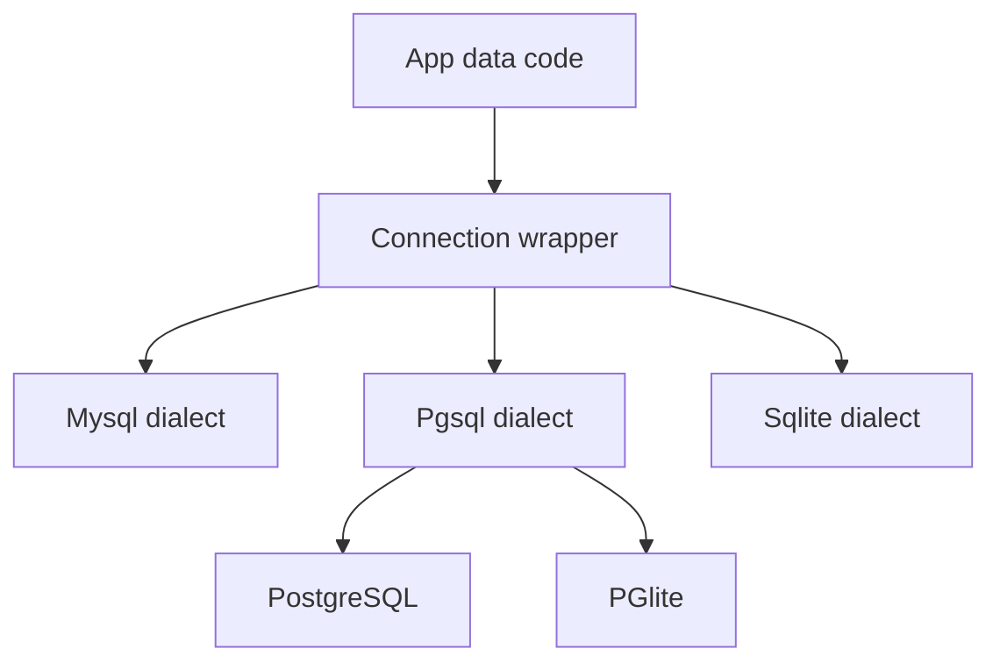

# 211 Dialects

A SQL dialect is the version of SQL that a database understands. The same app
idea can target PostgreSQL, MySQL, or SQLite, but the exact SQL text, type
mapping, identifier quoting, JSON behavior, and placeholder format can differ.

**Previously:** `Connections` showed how a native database driver becomes a
shared engine. Here, the focus shifts to the dialect rules that sit under that
engine.

## 211.1. The Decision

Most Stackpress app code should choose a connection wrapper, not a dialect
object by hand. The connection points to the real driver, and the wrapper
selects the dialect that knows how to build SQL for that database family.

This matters because a database is not just a place to store rows. It also
decides how identifiers are quoted, how generic types become SQL column types,
and how values are passed into prepared queries.

## 211.2. Recommended Default

Use PGlite for the course path unless a lesson is specifically about another
database. A scaffolded app confirms that path by creating a local PGlite
resource from `DATABASE_URL` or `./.build/database`, then wrapping it with
`stackpress/pglite`.

```ts
import { PGlite } from '@electric-sql/pglite';
import { connect as pglite } from 'stackpress/pglite';

const url = process.env.DATABASE_URL || './.build/database';

export default async function connect() {
  return pglite(async () => {
    return new PGlite(url);
  });
}
```

This example is the local default because it gives the app a database without
requiring a separate database server. The important idea is not that every app
must use PGlite; it is that the connection wrapper chooses the right SQL
dialect for the database you gave it.

## 211.3. Dialect Options

Inquire exposes three root dialect objects: `Mysql`, `Pgsql`, and `Sqlite`.
PGlite uses the PostgreSQL-style dialect behavior through its connection
wrapper, so it belongs with the PostgreSQL path when you are thinking about
generated SQL.



The diagram shows why the connection is the normal choice for app code. You
pick the database wrapper, and the wrapper carries the dialect rules into the
engine.

## 211.4. Tradeoffs

The main tradeoff is setup cost versus environment fit. A local course project
benefits from PGlite because it is file-backed and easy to inspect, while a
deployed app may need PostgreSQL or MySQL because that is what the hosting
environment provides.

Dialect differences show up most clearly when the engine turns builder state
into SQL. The same high-level builder can produce different SQL details
depending on the active dialect.

```ts
const request = engine.select('*')
  .from('users')
  .where('id = ?', [1])
  .query(Pgsql);
```

This example asks the builder to create a PostgreSQL-shaped query object.
PostgreSQL-style connections rewrite `?` placeholders to `$1`, `$2`, and so
on before the native driver runs the query.

```ts
const request = engine.create('users')
  .addField('id', { type: 'integer', autoIncrement: true })
  .addPrimaryKey('id')
  .query(Sqlite);
```

This example asks for a SQLite-shaped create-table query. SQLite uses different
type mappings than PostgreSQL, so a generic field type may become a different
SQL column type depending on the dialect.

## 211.5. Example Choice

For a first local app, choose the PGlite connection path from the scaffold. It
keeps the database close to the project, lets you inspect local state, and
matches the course path used by later data lessons.

For a production PostgreSQL app, choose a PostgreSQL connection and let that
wrapper apply the `Pgsql` dialect rules. For a production MySQL app, choose a
MySQL connection and let that wrapper apply the `Mysql` dialect rules.

For a SQLite-specific app, choose a SQLite connection when the app really needs
SQLite behavior. The source dialect docs call out SQLite-specific type mapping
and alter-table limits, so do not assume every schema operation behaves the
same across database families.

## 211.6. Mistakes To Avoid

Dialect mistakes usually come from treating all SQL engines as interchangeable.
The builder surface hides many differences, but it does not erase the database
you actually chose.

### 211.6.1. Pick A Dialect Before Picking A Driver

```ts
const request = engine.select('*').from('users').query(Pgsql);
```

This is useful for inspecting SQL, but it is not the normal way to wire a
Stackpress app. Choose the connection wrapper first so the runtime database,
driver, and dialect stay together.

### 211.6.2. Assume JSON Fields Map The Same Everywhere

```text
Pgsql: json -> JSONB
Mysql: json -> JSON
Sqlite: json -> TEXT
```

The generic idea is "store JSON", but the database type is dialect-specific.
That matters when you inspect generated schema output or write raw SQL against
JSON fields.

### 211.6.3. Ignore Placeholder Rules In Raw SQL

```sql
SELECT * FROM users WHERE id = ?
```

Builder and connection paths can adapt placeholders for the driver. When you
debug raw SQL, remember that PostgreSQL-style connections rewrite placeholders,
while MySQL and SQLite-style paths keep `?` placeholders.

## 211.7. Next Step

Dialects are the reason database lessons need a concrete local target. Once
you know which dialect is active, generated SQL, raw queries, schema output,
and data verification become much easier to inspect.

**Learning checkpoint:** Before moving on, make sure you can explain why
Stackpress course examples start with a connection wrapper instead of a bare
dialect object. You should also know that PGlite follows the PostgreSQL-style
dialect path.

**Next course:** Continue with `SQLite / PGlite`. That course turns the local
database choice into a hands-on setup and verification flow.
